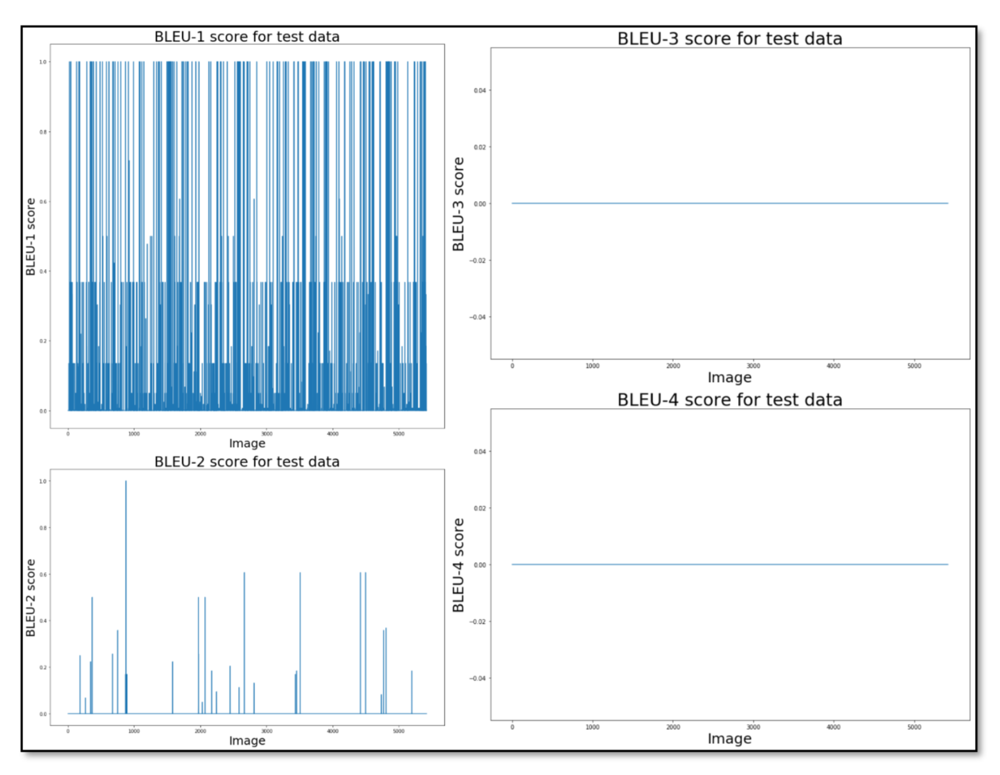

# Objectives
1. Generate hashtags for Instagram images using soft-attention mechanism as described in the paper Show, Attend and Tell: Neural Image Caption Generation with Visual Attention.(https://arxiv.org/abs/1502.03044)
2. Explore the possibility of using the hashtags to generate narrative caption for the image.
3. Compare model performance with other state-of-the art techniques of image captioning.
4. Analysis of the results.

# Methodology

 Source: Adapted from [3]

## First, generate hashtags for an input image by using soft-attention model.

Attention mechanism focusses on important features of the image. The model takes an image I as input and produces a one-hot encoded list of hashtags denoted by X where |X| >= 1 and X = {x1, x2, x3, x4........, xN}, such that xi ∈ RK [3]. K is the size of the vocabulary and N is the number of hashtags generated for the image.

Image features are extracted from lower CNN layers (ENCODER). The decoder uses a LSTM that is responsible for producing a hashtag (one word) at each time step t, which is conditioned on a context vector zt, the previous hidden state ht and the previously generated hashtag. Soft attention mechanism is used to generate hashtags. 

 
 
Source: Adapted from [3]

The entire network was trained from end-to-end. InceptionV3 (pretrained on Imagenet) was used to classify images in the HARRISON dataset and features were extracted from the last convolutional layer.To generate hashtags, the CNN-LSTM model with embedding dimension size of 256, 512 GRU(LSTM) units and Adam optimizer was trained for 40 epochs on a GEForce GTX Titan GPU with each epoch taking about 2.5 hours.
The model was trained on 80 percent of data (around 43K images) while the remaining was used for testing.

 Summary of the training details for the soft-attention model used for hashtag generation.

## Second, leverage the hashtag from previous stage to produce a short story by using a character-level language model.

 Source: Adapted from [6]

The RNN models the probability distribution of the characters in sequence given a sequence of previous characters [7].The hashtag generated in phase 1 is chosen as seed text and using the character sequences of this seed text, new characters are generated in sequence.The model is trained to generate narratives by adopting the writing style in the corpus using the hashtag.

The character - level RNN model is trained on ‘PersonaBank’ corpus which is a collection of 108 personal narratives from various weblogs. The corpus is described in the paper: PersonaBank: A Corpus of Personal Narratives and Their Story Intention Graphs (https://arxiv.org/abs/1708.09082). These stories cover a wide range of topics from romance and wildlife to travel and sports.
Out of 108 stories, 55 are positive stories while the remaining are negative. Average length of story in the corpus is 269 words.

The language model is trained using a standard categorical cross-entropy loss.The language model was trained for 100 epochs with word embedding dimension size of 1024, 2 LSTM layers, softmax activation function, RMSProp optimizer and a learning rate of 0.01on a GEForce GTX Titan GPU to generate stories with 500 characters in length.

# Model evaluation

Performance of soft-attention model was compared with that of CNN-LSTM based image captioning model and multi-label image classifier. BLEU-N and ROGUE-L scores were used to evaluate the model peformance. 

## 1. Hashtags generation using soft-attention model (Show, attend and tell)

- Harrison dataset is used which is preprocessed and split into (80:10:10) train/validation/test ratio by preprocess.py file
- Soft-attention model is trained using tensorflow_attention.py in the Show, attend and tell (Soft Attention) directory.
- The code in the tensorflow_attention.py is adapted from "https://github.com/tensorflow/docs/blob/master/site/en/r2/tutorials/text/image_captioning.ipynb"
- The test data results, loss_epoch, perplexity_epoch readings obtained from the after training the model are saved in the Show, attend and Tell (Soft Attention) directory.
- The model requires Keras, Tensorflow and Python 3.6 to train. The requirements can be installed in anaconda environment using environment_tensorflow.yaml

 Training Loss vs Epoch curve 

 Soft-attention model performance evaluation through the plot of BLEU-N score versus the images in the test dataset. 

## 2.  Hashtags generation using CNN-LSTM based model (Show and tell)

- Harrison dataset is used which is preprocessed and split into (80:10:10) train/validation/test ratio by preprocess.py file
- CNN-LSTM model (defined in model.py) is used to train the model using train.py in the Show and tell directory.
- Run build_vocab.py --> train.py to train the model. Run sample.py to generate test data results.
- The code is adapted from "https://github.com/yunjey/pytorch-tutorial/tree/master/tutorials/03-advanced/image_captioning"
- Requires PyTorch setup which can be done by creating a pytorch environment using environment_pytorch.yaml

 Show and Tell model performance evaluation through the plot of BLEU-N score versus the images in the test dataset.

## 3. Hashtags generation using Multi-label image classification

- train2.py is used to generate hashtags using AlexNet implemented using Keras by running in tensorflow environment.
- The test data results, loss_epoch (train and validation), accuracy_epoch(train and validation) readings obtained after training and validation of the model are saved in the Multi-label image classification directory.

 AlexNet model performance evaluation through the plot of BLEU-N score versus the images in the test dataset.

## 4. Story generation using Character-level language model

- model trained using tensorflow
- model trained on PersonaBank corpus saved in new_persona.txt. (Preprocessed version of persona data) 
- train model by running char_lang_model.py in tensorflow environment.

# Results

  
 Examples of hashtags predicted by the soft-attention model.

  
 Examples of narrative captions generated from the hashtag.

# Performance on MS COCO dataset

Though the main objective of this work is to use the soft-attention mechanism to generate hashtags and explore if it is possible to generate meaningful paragraph style captions for the image, it would not be a bad idea indeed to know how the model fairs in producing sentence level captions instead as originally the model was developed to generate sentence level captions. Hence, to evaluate this capability of the soft-attention mechanism, the model was trained on the popular MSCOCO dataset. The data was processed and trained in the same way as mentioned earlier. The only difference is that due to huge size of the MSCOCO dataset, the dataset size was reduced to 10000 images and the model was only trained for 5 epochs.

- 
  
 Performance of soft-attention model on MSCOCO dataset.

# Publication

The novel idea of story generation from the hashtags for the images was accepted and published in the 2019 IEEE 35th International Conference on Data Engineering Workshops (ICDEW). (https://ieeexplore.ieee.org/abstract/document/8750908 , DOI: 10.1109/ICDEW.2019.00060 ). Title of the paper: Generation of a Short Narrative Caption for an Image Using the Suggested Hashtag

# Conclusion & Future Work

The work successfully achieves the goal of generating hashtags for an image. The soft-attention mechanism, originally used to generate sentence-level captions, does a good job in generating good quality hashtags for many test cases. However, it can also be stated that the model is not even close to being perfect in predicting highly quality hashtags. This is evident from the results. But the model still does a fine job in predicting hashtags if not the best. The BLEU-N and ROUGEN metrics are only helpful in determining to what extent the predicted output deviates quantitatively from the ground truths. These metrics fail to measure the machine translated text or predicted captions contextually. The challenge is to look for metrics that can evaluate image captions both in term of similarity and context.

Another objective of the work was to explore the possibility of using hashtags to generate good quality captions, but the approach of using hashtags to generate narrative captions for the image was not successful as one should have expected. It cannot be denied that stories lacked a proper grammatical structure which made it hard to determine the hidden context that existed if any. It will not be an exaggeration to say that the character-level language failed extensively in mimicking human beings and writing narratives similar to those written by an actual person. It can be argued that it was not an entire fault of the RNN model. The problem lied in the dataset chosen for training the model. It is a fact that a small sized corpus like ‘PersonaBank’ made it hard for the model to learn well and optimise weights in order to minimise the cross-entropy loss. The reason for choosing the ‘PersonaBank’ was that the original text in the corpus came from real people and it was assumed that if the character-level RNN could learn to write stories, the way they were in the ‘PersonaBank’ corpus, they could match with the image context in some way or the other. This was the second challenge, challenge to find a corpus of real-life anecdotes, incidents and events that was big enough to make a language model learn and to re-write text contained in the corpus.

As mentioned earlier the work is far enough from meeting the high expectations, but lessons learnt while implementing the work are precious and will form the base to incorporate improvements in the future. One of the most important lessons learnt is that without image attributes, it is not easy to produce narrative captions that can match the context of the image. For example, one useful approach can use image features extracted from CNN during the process of story generation with word-level language model instead of the character-level language model. Another useful technique would be to use skip-thought vectors, which uses an encoder to encode sentences and then the decoder predicts the previous and next sentence based on the input sentence. Generating sentences in such a way helps in producing highly contextual and meaningful text.

# References

[1] S. Bai and S. An, “A survey on automatic image caption generation,” Neurocomputing, vol. 311, pp. 291-304, 2018.

[2] N. Newhall, “THE CAPTION: THE MUTUAL RELATION OF WORDS / PHOTOGRAPHS,” Aperture, vol. 1, pp. 17-29, 1952.

[3] G. Srivastava and R. Srivastava, “A Survey on Automatic Image Captioning,” in Springer, Singapore, 2018.

[4] A. Karpathy, “Connecting images and natural language,” Stanford University, Dept. of Computer Science., Stanford, 2016.

[5] T. Kim, M.-O. Heo, S. Son, K.-W. Park and B.-T. Zhang, “GLocal Attention Cascading Networks for Multi-image Cued Story Generation,” arXiv.org, 2019.

[6] C. Lee and D. Chau, “Language as pride, love, and hate: Archiving emotions through multilingual Instagram hashtags,” Discourse, Context & Media, vol. 22, pp. 21-29, 2018.

[7] E. Denton, J. Weston, M. Paluri, L. Bourdev and R. Fergus, “User Conditional Hashtag Prediction for Images,” in Proceedings of the 21th ACM SIGKDD International Conference on knowledge discovery and data mining, 2015.

[8] O. Vinyals, A. Toshev, S. Bengio and D. Erhan, “Show and Tell: A Neural Image Caption Generator,” in IEEE Conference on Computer Vision and Pattern Recognition, 2015.

[9] I. Sutskever, J. Martens and J. Hinton, “Generating Text with Recurrent Neural Networks,” in Proceedings of the 28 th International Conference, Bellevue, WA, USA, 2011.

[10] M. Park, H. Li and J. Kim, “HARRISON: A Benchmark on HAshtag Recommendation for Real-  world Images in Social Networks.,” ArXiv.org, 2016.

[11] M. S. Lukin, K. Bowden, C. Barackman and A. M. Walker, “PersonaBank: A Corpus of Personal  Narratives and Their Story Intention Graphs,” arXiv.org, 2017.

[12] S. Marsland, “ Neurons, Neural Networks,and Linear Discriminants,” in Machine Learning : An  Algorithmic Perspective, CRC Press LLC, 2014, pp. 39-70.

[13] M. Alom, T. Taha, C. Yakopcic, S. Westberg, P. Sidike, B. Van Esesn, A. Awwal and V. Asari, “The History Began from AlexNet: A Comprehensive Survey on Deep Learning Approaches,”arXiv.org, 2018.

[14] Y. Lecun, Y. Bengio and G. Hinton, “Deep learning,” Nature, vol. 521(7553), p. 436, 2015.

[15] H. Salehinejad, S. Sankar, J. Barfett, E. Colak and S. Valaee, “Recent Advances in Recurrent  Neural Networks,” arXiv.org, 2018.

[16] K. Xu, J. Ba, R. Kiros, K. Cho, A. Courville, R. Salakhutdinov, R. Zemel and Y. Bengio, “Show, Attend and Tell: Neural Image Caption Generation with Visual Attention,” arXiv.org, 2016.

[17] K. Papineni, S. Roukos, T. Ward and W.-J. Zhu, “BLEU: a Method for Automatic Evaluation of  Machine Translation,” in Proceedings of the 40th Annual Meeting of the Association forComputational Linguistics (ACL), Philadelphia, 2002.
[18]X. Chen, H. Fang, L. Tsung-Yi, R. Vedantam, S. Gupta, P. Dollar and C. Zitnick, “Microsoft COCO Captions: Data Collection and Evaluation Server,” arXiv.org, 2015.

[19] D. Kingma and J. Ba, “ADAM: A METHOD FOR STOCHASTIC OPTIMIZATION,” arXiv.org, 2017.

[20] “tf.nn.sparse_softmax_cross_entropy_with_logits,” TensorFlow, [Online]. Available:https://www.tensorflow.org/api_docs/python/tf/nn/sparse_softmax_cross_entropy_with_logits. [Accessed 09 June 2019].

[21] Y. Bengio, R. Ducharme, P. Vincent and C. Jauvin, “A Neural Probabilistic Language Model,”Journal of Machine Learning Research, vol. 3(6), pp. 1137-1155, 2003.

[22] X. Wang, W. Chen and W. Yuan-Fang, “No Metrics Are Perfect: Adversarial Reward Learning for Visual Storytelling,” arXiv.org, 2018.

[23] C. C. Park, B. Kim and G. Kim, “Attend to You: Personalized Image Captioning with Context Sequence Memory Networks,” in 2017 IEEE Conference on Computer Vision and Pattern Recognition, 2017.

[24] F. Ting-Hao, N. Huang, I. Ferraro, A. Mostafazadeh, J. Misra, R. Agrawal, X. Devlin, P. Girshick, ] D. He, C. Kohli, D. Batra, L. Zitnick, M. Parikh, M. Vanderwende and M. Galley, “Visual Storytelling,” arXiv.org, 2016.

[25] D. Gonzalez-Rico and G. Fuentes-Pineda, “Contextualize, Show and Tell: A Neural Visual Storyteller,” arXiv.org, 2018.
